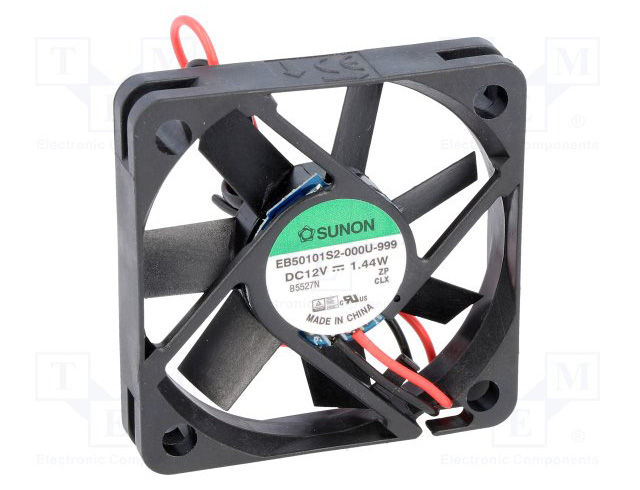
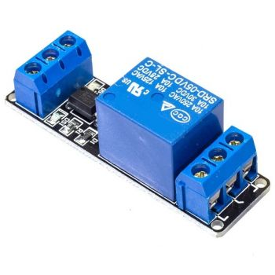
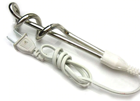
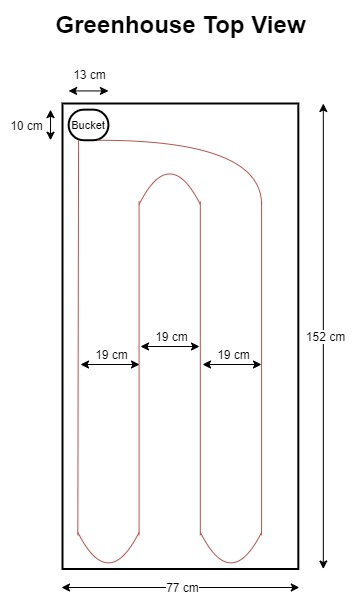
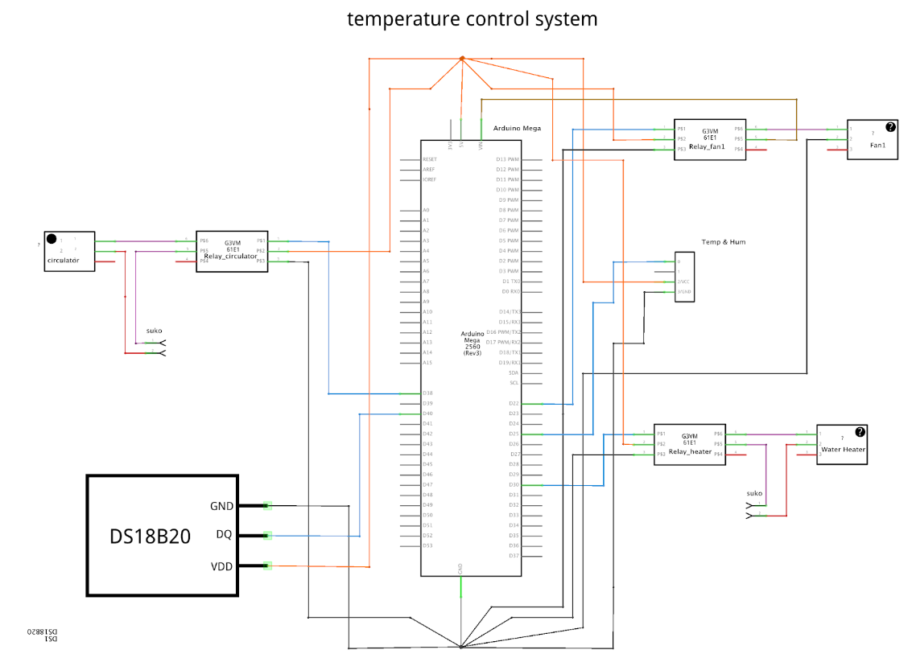

# Microcontroller Developers (MD) Team

## The duties of a MD
The MD team programs microcontrollers (ie Arduino) and makes sure that every sensor is well calibrated and returns right measurements. The team also suggests solutions on the mechanics of the greenhouse and is responsible for the implementation of the automations. 

## Temperature & Humidity control
Two DHT11 sensors measure temperature and humidity inside and outside the greenhouse.

### Temperature control

#### Cooling system
The cooling system that is used in this project is based on the principle
of temperature reduction in an effective way, when the temperature values in the greenhouse 
exceed a specific limit.

The cooling system consists of the following basic components: 
* fans (There are six fans that are used)
* a wet pad
* a relay
* power supply

###### Brief description of components:
The fans are working with 12V DC voltage and are supplied by power supply.
In addition, relay is used for controlling the operation of fans with Arduino.
Finally, the wet pad is a small piece of paper that is needed for the cooling system.

###### How does the cooling system actually works?
First of all, the greenhouse has on one side the fans which push air out of the greenhouse. 
As a result of this, the air enters from the opposite side of the greenhouse, 
where the wet pad that we described shortly above, exists. Due to the
fact that the pad is wet, the air entering into the greenhouse is cool. This leads to 
a decrease of temperature into the greenhouse and therefore our goal for implementing 
an efficient cooling system is achieved.

#### Heating system
A system similar to underfloor heating will be used. The heating system has one bucket with water. Water is heated with the help of a water heater / immersion rod. 

The heater’s operation is controlled by Arduino microcontroller. Hot water flows through pipes covering the entire floor of the greenhouse. These pipes are under the plants, taking advantage of the fact that hot air moves up.

The heating system consists of:
* water heater (Immersion Rod)
* bucket
* water temperature sensor (to ensure that heated water does not exceed 40 degrees Celsius)
* pipes
* circulator

This system is energy efficient because, unlike air, water tends to retain its temperature and this helps to keep the greenhouse warm for longer. Another advantage is that the plants are heated gradually (not instantly) and the heat is well distributed (not in one spot).

#### Electrical plan for temperature control (both cooling and heating)

### Humidity control

#### Increasing Humidity
...

#### Decreasing Humidity
...

## Substrate Moisture control
Soil humidity sensor manages the operation of the watering system.

#### Watering system
The watering system that we have in this project is simillar to those that implement the process of irrigation in the fields and especially in greenhouses.

The watering system consists of the following components:
* The main (central) pipes of water.
* An electrovalve
* A relay
* The smaller pipes that end up inside the greenhouse.
	
To begin with, water flows through the central pipes until it reaches to the electrovalve.
The electrovalve is an electrical component which has a throttle valve at the inside of it's structure. We want to regulate approprietely at any moment if the water will pass in order to water the plants in greenhouse or if it has to be blocked because it will be needless to water our plants. 
When we want to allow the water flow towards the greenhouse the relay which is controled by arduino and is connected suitably in our electrical circuit, will give a signal to the electrovalve and then the throttle valve will open for the water to pass. The same thing happens when we want to stop the water flow and of course then the valve will close.

Finally, it is worth to be mentioned that once the water passes from the electrovalve mechanism then it will be 
splitted to the smaller pipes in order to water our plants in the greenhouse.

This automation of watering system helps us control the water flow with a more effective way 
and also contributes to reduce significantly the amount of water that is wasted for no reason.

## Luminocity control
A photoresistor captures changes in luminocity level.

#### More light
...

#### Less light
...

## pH control
A liquid pH sensor indicates whether pH is out of regular value range, meaning that substrate should be replaced with a new one.
